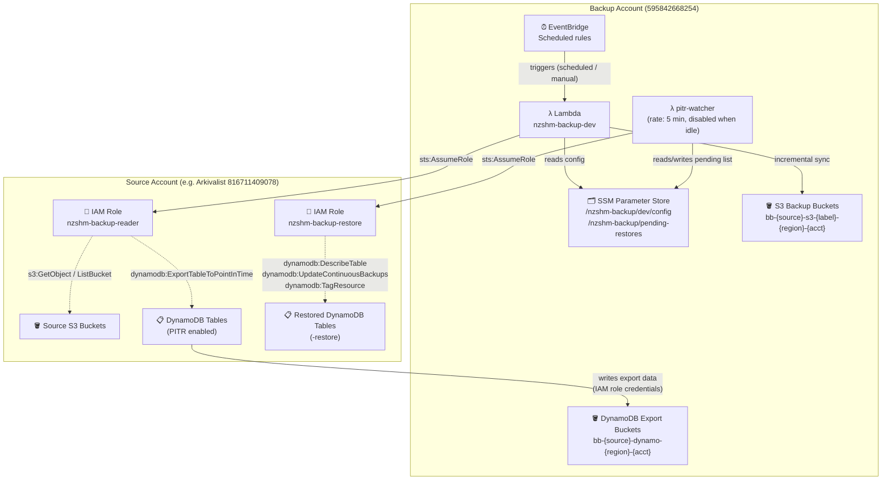
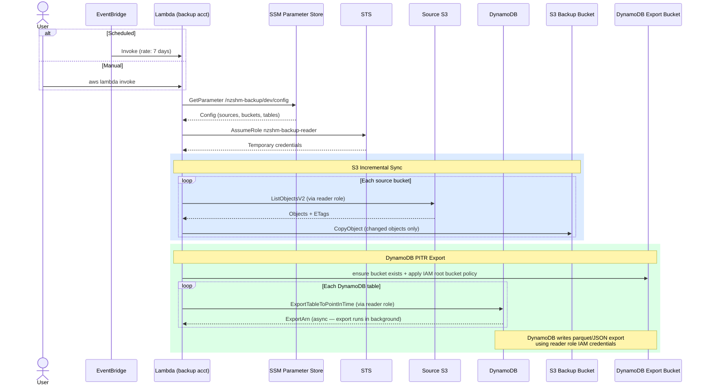

# Architecture Overview

## Account Layout

Two AWS accounts are involved. The backup Lambda runs in the **backup account** and assumes
a cross-account role to access source data in each **source account**.

Two cross-account roles exist per source (created by `scripts/create-source-roles.py`):

- **`nzshm-backup-reader`** — read-only; assumed by the backup Lambda for S3 sync and DynamoDB exports
- **`nzshm-backup-restore`** — assumed by the restore CLI and pitr-watcher Lambda for PITR restore, PITR re-enable, and tagging



---

## Backup Trigger Flow

Shows the sequence from trigger to completion for a single source.



---

## Restore Flow

DynamoDB restores are submit-and-return (async, 2–8 hours). S3 restores use
direct copy (small buckets) or S3 Batch Operations (large buckets).


---

## Bucket Naming Convention

| Type | Pattern | Example |
|------|---------|---------|
| S3 backup | `bb-{source}-s3-{label}-{region}-{source-acct}` | `bb-arkivalist-s3-deploy-ap-southeast-2-816711409078` |
| DynamoDB export | `bb-{source}-dynamo-{region}-{source-acct}` | `bb-arkivalist-dynamo-ap-southeast-2-816711409078` |

All backup buckets are:
- Tagged `ManagedBy: nzshm-backup`
- Protected against deletion (no `s3:DeleteObject` in Lambda IAM role)
- Tiered: Standard (30d) → Glacier Instant (90d) → Deep Archive (365d)

---

## Cross-Account IAM

For each cross-account source, a one-time setup creates both roles:

```bash
scripts/create-source-roles.py \
    --config backup-config.yaml \
    --source <alias>
```

Both role ARNs are written back to the config file automatically.

**`nzshm-backup-reader`** (assumed by backup Lambda):
- `s3:GetObject`, `s3:ListBucket` on named source buckets
- `dynamodb:ExportTableToPointInTime`, `dynamodb:DescribeContinuousBackups` on named tables
- `dynamodb:ListExports`, `dynamodb:DescribeExport` for status queries
- `s3:PutObject` on `bb-*` backup buckets (DynamoDB cross-account exports write
  using the calling role's credentials, not the `dynamodb.amazonaws.com` service principal)

**`nzshm-backup-restore`** (assumed by restore CLI and pitr-watcher Lambda):
- `dynamodb:RestoreTableToPointInTime` on named source tables
- `dynamodb:*` on `table/*` in the source account — required because
  `RestoreTableToPointInTime` makes undocumented internal calls (Scan, Query, etc.)
  on the restore target table; resource-level scoping is not practical
