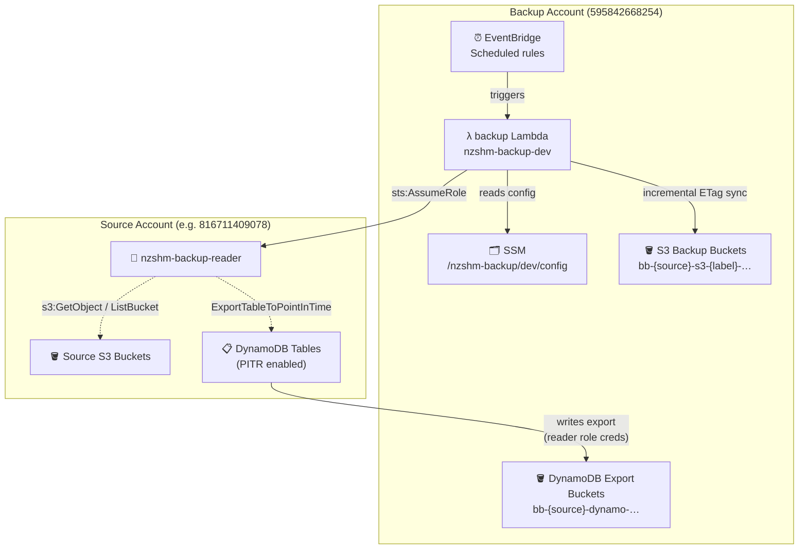
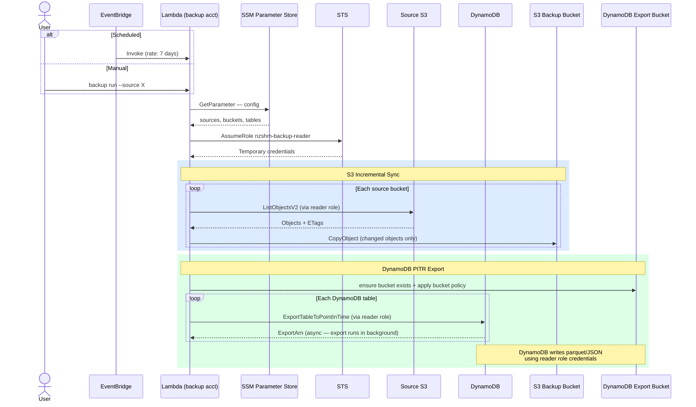
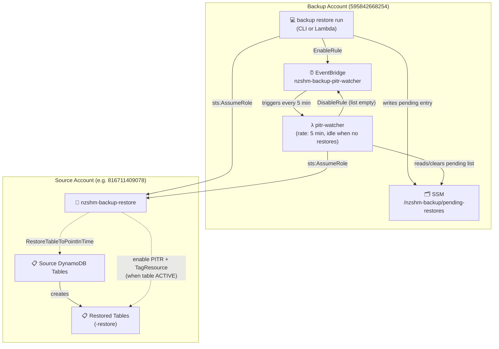
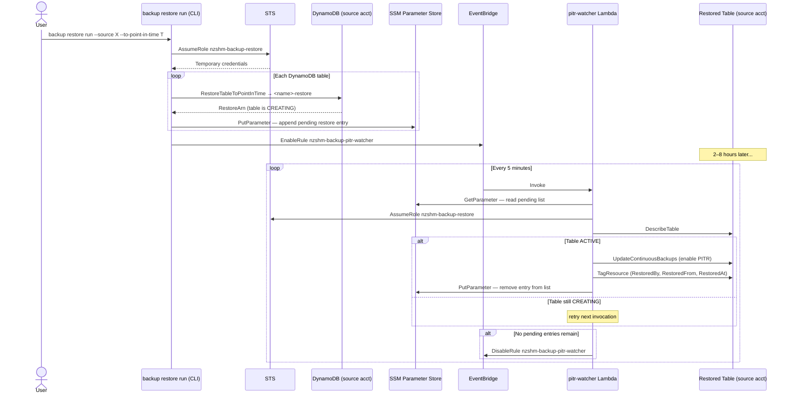

# Architecture Overview

## Key Components

| Component | Location | Purpose |
|-----------|----------|---------|
| **backup CLI** | Backup account — local or Lambda | Runs incremental S3 sync and DynamoDB PITR exports; all subcommands |
| **EventBridge rules** | Backup account | Triggers the backup Lambda on a schedule (`nzshm-backup-{source}-{frequency}`) |
| **backup Lambda** | Backup account | Executes `backup run` on a schedule; same code as the CLI |
| **pitr-watcher Lambda** | Backup account | Polls every 5 min for completed DynamoDB restores; re-enables PITR and applies tags |
| **SSM Parameter Store** | Backup account | Stores config (`/nzshm-backup/dev/config`) and pending restore list (`/nzshm-backup/pending-restores`) |
| **S3 backup buckets** | Backup account | Receive incremental S3 copies; tiered Standard (0–30d) → Glacier Instant Retrieval (forever) — see [ADR-006](../design/adr/ADR-006-simplify-storage-tiers-drop-deep-archive.md) |
| **DynamoDB export buckets** | Backup account | Receive `ExportTableToPointInTime` parquet/JSON snapshots |
| **`nzshm-backup-reader` IAM role** | Source account | Assumed by backup Lambda; read-only S3 + DynamoDB export access |
| **`nzshm-backup-restore` IAM role** | Source account | Assumed by restore CLI and pitr-watcher; DynamoDB PITR restore + PITR re-enable + tagging |

Two AWS accounts are involved. The backup Lambda runs in the **backup account** and assumes
a cross-account role to access source data in each **source account**. See
[Account Isolation](../design/ACCOUNT_ISOLATION.md) and
[IAM Security Decisions](../design/iam-security-decisions.md) for full IAM details.

---

## Backup



### Backup sequence

EventBridge (or a manual CLI call) triggers the Lambda, which reads config from SSM,
assumes the reader role in the source account, and runs an incremental S3 sync followed
by DynamoDB PITR exports.



---

## Restore



### Restore sequence

DynamoDB restores are submit-and-return (async, 2–8 hours to complete). The
pitr-watcher Lambda polls SSM every 5 minutes to detect when the restored table
becomes ACTIVE, then re-enables PITR and applies tags.



---

## Bucket Naming Convention

| Type | Pattern | Example |
|------|---------|---------|
| S3 backup | `bb-{source}-s3-{label}-{region}-{source-acct}` | `bb-arkivalist-s3-deploy-ap-southeast-2-816711409078` |
| DynamoDB export | `bb-{source}-dynamo-{region}-{source-acct}` | `bb-arkivalist-dynamo-ap-southeast-2-816711409078` |

All backup buckets are tagged `ManagedBy: nzshm-backup`, protected against deletion
(no `s3:DeleteObject` in Lambda IAM), and tiered Standard (0–30d) → Glacier Instant
Retrieval (30d+, forever — see [ADR-006](../design/adr/ADR-006-simplify-storage-tiers-drop-deep-archive.md)).

---

## Cross-Account IAM Setup

One-time setup per source account:

```bash
python scripts/create-source-roles.py --config backup-config.yaml --source <alias>
```

Both role ARNs are written back to the config automatically. See
[IAM Security Decisions](../design/iam-security-decisions.md) for the full permission breakdown.
