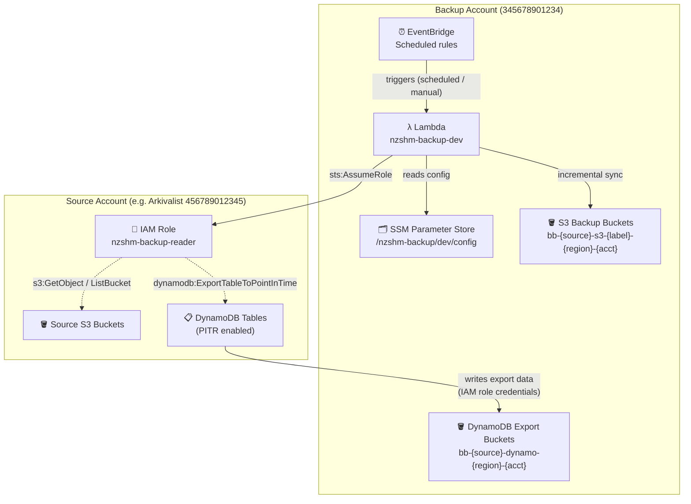
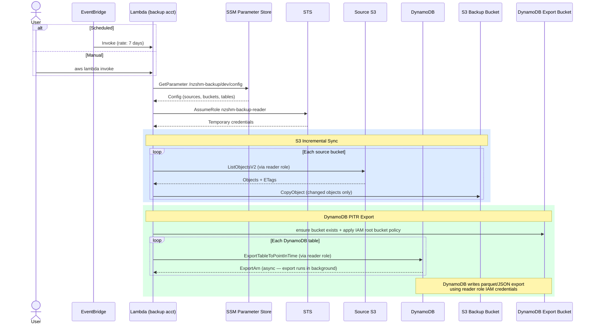

# Architecture Overview

## Account Layout

Two AWS accounts are involved. The backup Lambda runs in the **backup account** and assumes
a cross-account reader role to access source data in each **source account**.



---

## Backup Trigger Flow

Shows the sequence from trigger to completion for a single source.



---

## Bucket Naming Convention

| Type | Pattern | Example |
|------|---------|---------|
| S3 backup | `bb-{source}-s3-{label}-{region}-{source-acct}` | `bb-arkivalist-s3-deploy-ap-southeast-2-456789012345` |
| DynamoDB export | `bb-{source}-dynamo-{region}-{source-acct}` | `bb-arkivalist-dynamo-ap-southeast-2-456789012345` |

All backup buckets are:
- Tagged `ManagedBy: nzshm-backup`
- Protected against deletion (no `s3:DeleteObject` in Lambda IAM role)
- Tiered: Standard (30d) → Glacier Instant (90d) → Deep Archive (365d)

---

## Cross-Account IAM

For each cross-account source, a one-time setup creates a reader role:

```
scripts/create-reader-role.py --backup-account-id 345678901234 \
    --dynamodb-tables table1 table2 \
    --s3-buckets bucket1
```

The reader role grants:
- `s3:GetObject`, `s3:ListBucket` on named source buckets
- `dynamodb:ExportTableToPointInTime`, `dynamodb:DescribeContinuousBackups` on named tables
- `dynamodb:ListExports`, `dynamodb:DescribeExport` for status queries
- `s3:PutObject` on `bb-*` backup buckets (needed because DynamoDB cross-account exports
  write using the calling role's credentials, not the `dynamodb.amazonaws.com` service principal)
